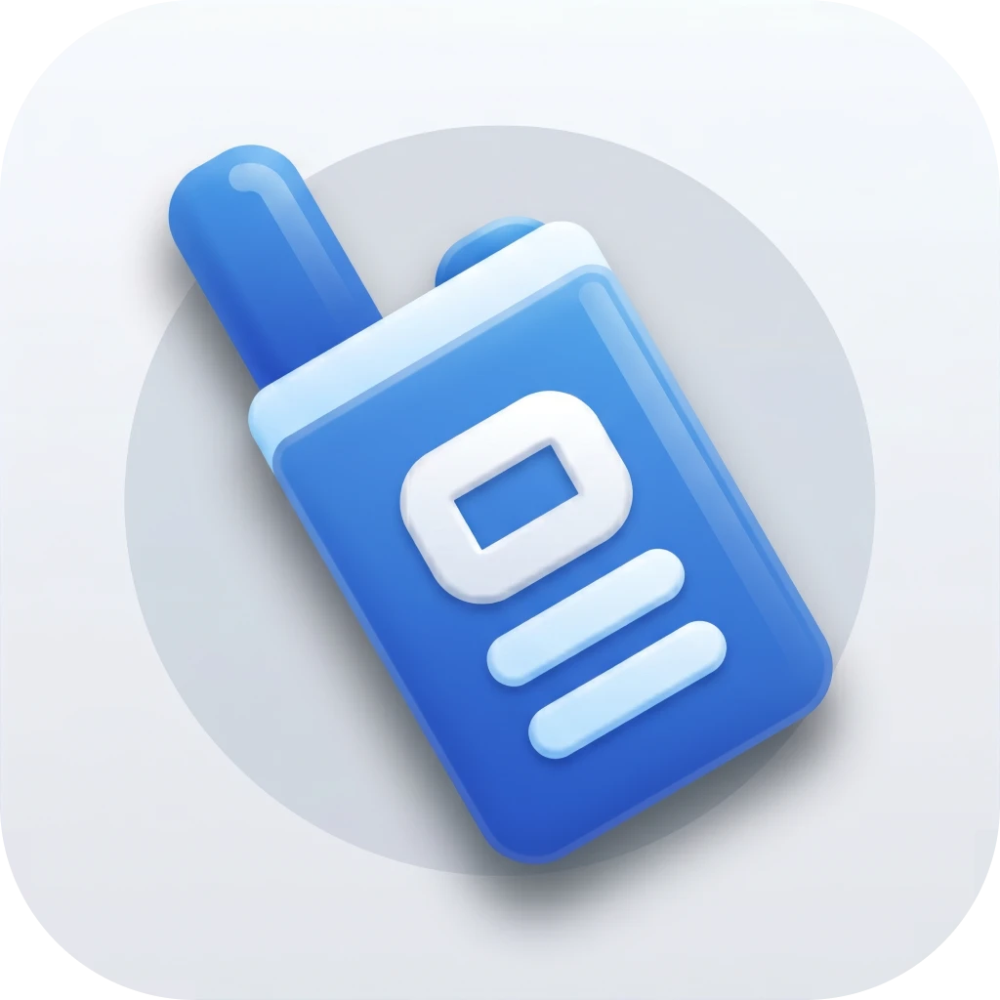

<p align="center">
  
</p>

# HoldSpeak

**Website: [holdspeak.app](https://holdspeak.app/)** · [Download](https://github.com/timmal/HoldSpeak/releases/latest) · [Free Superwhisper alternative — comparison](https://holdspeak.app/superwhisper-alternative.html)

Local push-to-talk dictation for macOS. HoldSpeak is a **menu bar app** (no Dock icon, no windows in the way) — it lives in the status bar and stays out of your workflow until you hold the hotkey. Speak, release — recognized text is inserted into the focused input. Local by default: Whisper runs on GPU via WhisperKit. Optionally, you can switch to Google Gemini with your own API key.

<p align="center">
  
</p>

A free, local alternative to paid Whisper wrappers. Built for one reason: talking to AI is faster than typing to it. Average typing speed hovers around 40–60 wpm; comfortable speech is 130–160 wpm — two to three times faster. As more of the dev loop moves into prompts to AI agents, raw typing throughput becomes a real ceiling on how quickly you can iterate. HoldSpeak lifts it: hold the hotkey, speak a full thought, release, it lands in the input.

## Features

- **Local transcription** through WhisperKit (CoreML, GPU)
- **Optional cloud engine** — Google Gemini with your own API key, for higher accuracy on mixed-language speech and jargon
- **Code-switching RU/EN/UK and more** — in auto mode the language is chosen only from the ones you have in System Settings → Language & Region
- **Insertion without clipboard** — via `CGEventKeyboardSetUnicodeString`; password fields are skipped
- **Menu bar popover** with recent transcriptions (click to copy) and metrics: dictations today / yesterday, 7-day avg WPM
- **HUD overlay** while you hold the key: dark pill with a live mic level; if a dictation fails (no model, bad API key, quota), the reason shows in the same pill
- **Light text cleanup** — trims long "eeeeee / mmmmm / ummm", collapses 3+ consecutive repeats, capitalizes the first letter and adds a period
- **Liquid Glass** on macOS 26 and later — the HUD, popover, Preferences and onboarding use the system glass; macOS 13–15 keep the classic look
- **Terminology dictionary** — canonical IT terms (pull request, Kubernetes, Claude Code, …) replace misrecognized Russian transliterations in transcripts; ships with ~110 defaults and is fully editable

## Install

Grab the latest DMG from the [Releases page](https://github.com/timmal/HoldSpeak/releases/latest), open it, and drag `HoldSpeak.app` into `Applications`.

Because the app is self-signed, macOS will block the first launch. Open **System Settings → Privacy & Security**, scroll to the message *"HoldSpeak was blocked…"* and click **Open Anyway**. Confirm with Touch ID / password. After that it launches normally from Launchpad / Applications. The app runs as a menu bar extra — look for the radio icon in the right side of your menu bar; it won't appear in the Dock or Cmd-Tab.

On first launch, choose how speech is recognized — **Whisper** (on this Mac, downloads a model) or **Gemini** (Google cloud, asks for your API key) — then grant three permissions:

- **Microphone** — for audio capture
- **Accessibility** — for the global hotkey and text insertion
- **Input Monitoring** — to use Right Option / Right Cmd (or the hotkey you choose) as push-to-talk

The onboarding window has Open… and Re-check buttons.

<p align="center">
  
</p>

### Updating

The app checks GitHub for new versions in the background and shows an **Update available** banner in the menu bar popover. You can also trigger a check manually via Preferences → General → **Check for updates**.

1. Click **Download** in the banner — it opens the latest release on GitHub.
2. Download the `.dmg`, open it, and drag `HoldSpeak.app` into `Applications`. macOS will ask to replace the old copy — confirm.
3. Quit the running app from the menu bar (Quit), then launch the new one from `Applications`.

Your preferences, history, and downloaded models live in `~/Library/Application Support/HoldSpeak/` and are preserved across updates.

### Model

The default is **Turbo (large-v3 distilled, ~800 MB)** — the best quality/speed trade-off. You can switch to Tiny or Small in Preferences → Audio.

If you already have MacWhisper / another WhisperKit client installed, their models will be picked up automatically. Otherwise the first model is downloaded to `~/Library/Application Support/HoldSpeak/Models/`.

To free disk space, Preferences → Audio → **Downloaded models → Delete…** removes every model HoldSpeak downloaded. Models that belong to MacWhisper or other apps are left alone.

### Gemini (optional, cloud)

Pick a Gemini model in Preferences → Audio → **Model** (or choose Gemini during onboarding) and paste an API key:

1. Create a key at [Google AI Studio → API keys](https://aistudio.google.com/apikey).
2. **Set up billing** for the key's project in AI Studio. Without billing the key runs on the free tier, which stops after a couple dozen dictations a day — HoldSpeak then shows *"Gemini daily limit reached — set up billing"* in the HUD.
3. Paste the key in HoldSpeak and click **Save**. The key is checked with Google and stored in the macOS Keychain, never in preferences files; it survives app updates. After each update macOS asks once to let the new version read the key — enter your Mac password and click **Always Allow** (HoldSpeak is self-signed, so the Keychain sees every new build as a new app).

<p align="center">
  
</p>

Models:

- **3.5 Transcribe** (default) — dedicated speech-to-text, ~2 s per dictation, about **$0.30 per hour of speech**.
- **3.5 Flash-Lite** — cheaper (~$0.06/hour) and better at following the terminology dictionary, but response time varies more.

If the selected model fails on Google's side (an error that isn't about the key, quota or network), HoldSpeak sends the same audio to the other model and says so in the HUD pill; the failed model is skipped for the next 30 minutes.

If something goes wrong, the reason appears right in the HUD pill instead of a silent empty result:

<p align="center">
  
</p>

Privacy: with Gemini, each dictation's audio is sent to Google. Whisper stays the default and never sends anything anywhere. Text cleanup, the "Add period" / "Capitalize" options and the terminology dictionary apply to both engines; Gemini also receives your dictionary's terms as spelling hints.

### Reducing insertion latency

The delay between releasing the hotkey and text appearing in the input is dominated by the Whisper forward pass. Two levers:

- **Pick a smaller model.** Preferences → Audio → *Model*:
  - **Tiny (~40 MB)** — fastest (~80–150 ms on Apple Silicon for a short utterance), lowest quality. Good for quick English/single-language dictation.
  - **Small (~250 MB)** — middle ground.
  - **Turbo (~800 MB)** — default; best quality but ~400–800 ms per utterance.
- **Set a fixed language** instead of Auto. Preferences → Audio → *Primary language*: picking Russian or English skips an extra language-detection forward pass that Auto mode runs before transcription.

Combining **Tiny + explicit language** gives the lowest end-to-end latency. Combining **Turbo + Auto** gives the best quality but is the slowest path.

## Usage

1. Hold **Right Option** (or whatever you set in Preferences).
2. Speak. A HUD appears in the top right corner (or bottom center — configurable) showing the mic level.
3. Release the key. After ~1–2 s the text is inserted into the focused field.
4. If the field lost focus — open the menu bar icon: it shows the recent transcriptions; click to copy.

### Short taps

By default, presses shorter than **150 ms** don't start recording — the key behaves as a normal Option. The threshold is configurable in Preferences → General (50–800 ms).

## Preferences

- **General** — hotkey, hold threshold, HUD position (under the icon / bottom center), theme (Auto / Light / Dark), launch at login, update check
- **Audio** — microphone, language, model (Whisper or Gemini), model download / deletion, Gemini API key
- **Terms** — terminology dictionary (see below)
- **History** — clear history and reset metrics
- **Support**

<p align="center">
  
  <br /><br />
  
</p>

### Auto language detection

In Auto mode the app reads `Locale.preferredLanguages` from the system and restricts Whisper to those languages only. So if macOS has RU, EN, UK enabled, Whisper will pick among them and won't drift into, say, Bulgarian.

When two of your preferred languages score close in detection (e.g. a sentence mixes Russian with English terms), the app drops the forced language for that utterance and lets Whisper switch per-segment — this tends to preserve English terms verbatim instead of transliterating them.

### Terminology dictionary

Whisper reliably recognizes common speech but routinely mangles IT terminology in mixed RU+EN dictation (`пулл реквест` instead of `pull request`, `кубернетес` instead of `Kubernetes`, and so on). The **Terms** tab lets you map your spoken variants to a single canonical form, which is then substituted in the transcript before it's inserted. Each Primary language keeps its own set of terms — in Auto mode the active set follows the detected language of the current utterance, so Russian-heavy speech uses your Russian dictionary and English-heavy speech uses the English one.

> **Tip.** If Whisper keeps mangling the same word or name — a project codename, a library you use daily, a colleague's surname — stop fighting the model. Open **Preferences → Terms**, put the correct spelling in *Canonical*, and add the two or three variants Whisper tends to produce. Next time the word shows up it'll come out right without any hand-editing. That's the whole point of this feature: if you have to fix the transcript by hand every time, it's not dictation — it's a slower way to type. Teach the app once, save the corrections forever.

<p align="center">
  
</p>

**Default dictionaries.** The app ships with curated IT defaults for **Russian (~110 entries)**, **English (~120)**, and **Ukrainian (~130)** — all spanning the whole dev cycle: VCS (pull request, rebase, cherry-pick), languages (TypeScript, Swift, Rust), frontend (React, Tailwind, Next.js), UX (wireframe, mockup, accessibility), backend (endpoint, middleware, migration), data (Postgres, Redis, ClickHouse), DevOps (Docker, Kubernetes, Helm chart), cloud (AWS, S3, Lambda), and AI tooling (Claude, MCP, Opus). On first launch the bundled lists are copied into your Application Support directory — from then on the files are yours.

**Switching languages in the editor.** Preferences → Terms has a **Last detected** picker (top-right, styled like the General dropdowns). It defaults to the language of your most recent utterance, but you can switch it to any other language to edit that set — handy for seeding an English dictionary before you start dictating in English.

**How updates work.** App updates do **not** touch your dictionary — your edits, additions, and deletions persist verbatim. To pull in new entries from the latest bundled default, open Preferences → Terms and click **Load defaults…**:

- **Merge** — adds only canonical forms that aren't already in your list. Existing entries and your custom terms are untouched.
- **Replace** — discards your list entirely and reloads the bundled defaults. Use with care.

**Adding your own terms.** Click **Add term**, put the target form in *Canonical* (`webp`), and list the variants Whisper tends to produce in *Variants* (one per line: `Веб-пи`, `вебпп`, `вепп`, `Беппи`). Matching is case-insensitive by default and respects word boundaries, so `пулреквест` won't hit inside `пулреквестер`.

**Import / Export.** Pure JSON — commit it to a dotfiles repo, share with a team, seed a new machine.

**Storage.** `~/Library/Application Support/HoldSpeak/terminology/<lang>.json` (one file per language: `ru.json`, `en.json`, `uk.json`, …).

## Architecture

- `Sources/Core` — pure logic (hotkey, recorder, inserter, text cleaner, storage, metrics, Gemini API client, Keychain)
- `Sources/Whisper` — transcription engines: WhisperKit (local) and Gemini (cloud) behind one `TranscriptionEngine` facade, model manager
- `Sources/UI` — SwiftUI: menu bar popover, preferences, onboarding, HUD
- `Sources/App` — AppDelegate and entry point

Transcription history is stored in a GRDB-SQLite database at `~/Library/Application Support/HoldSpeak/history.sqlite` (most recent 100 entries are kept).

## Logs

Diagnostic events go to `~/Library/Logs/HoldSpeak.log`. Useful for microphone / language detection / hotkey issues:

```bash
tail -f ~/Library/Logs/HoldSpeak.log
```

## Troubleshooting

**Hotkey doesn't fire.** Check Input Monitoring and Accessibility in System Settings → Privacy & Security. When the signature changes (e.g. a fresh ad-hoc build) TCC may drop entries — delete and re-add, or run `scripts/setup-signing.sh` and rebuild.

**Recognizes silence / empty result.** Check the input level in System Settings → Sound → Input. In the logs, look at `finalize: rms=...` — normal speech is ≥ 0.02. If you see `0.0005` the mic is quiet (wrong device / muted / mic TCC not granted).

**Confuses Ukrainian / Russian with English in auto.** Auto relies on `Locale.preferredLanguages`. Make sure the language is actually listed in System Settings → Language & Region, or switch Preferences → Audio from Auto to an explicit Russian / English.
